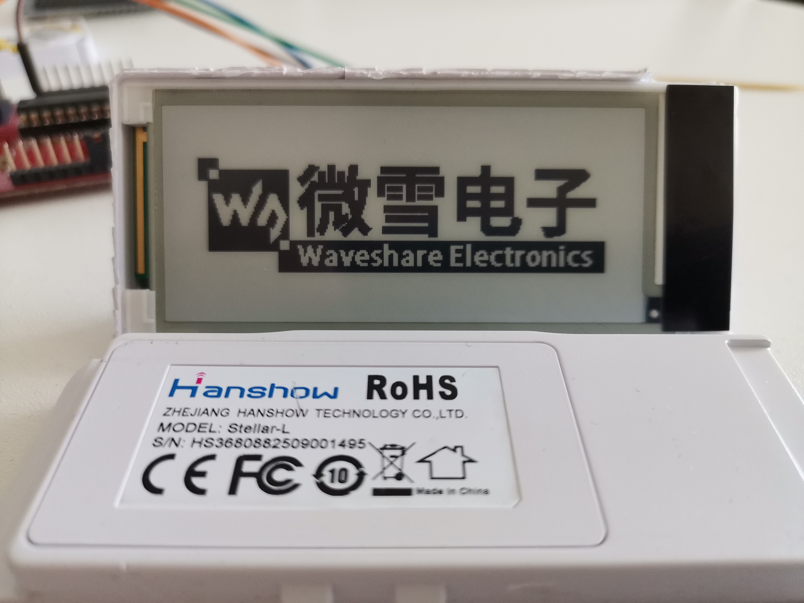

# Hanshow 2in9 epaper demo

## 简介

从某宝买了两个二手的汉朔2.9寸墨水屏电子价签，拆掉了其中一个，内部使用的是msp430g2553微控制器，墨水屏丝印为`HINK-E029A01-FPC-A1`，墨水屏与控制器的电气连接关系如下。

```
                MSP430G2553
            ------------------
           | 1             28 |
           | 2        P2.6 27 | --> 墨水屏电源MOS-FET,低电平导通
           | 3             26 |
           | 4             25 |
           | 5             24 |
           | 6             23 |
           | 7             22 |
    BS <-- | 8  P3.1       21 |
           | 9        P3.6 20 | --> RST#
           | 10       P3.5 19 | --> D/C#
           | 11       P2.5 18 | --> BUSY
           | 12       P2.4 17 | --> DI
           | 13       P2.3 16 | --> CLK
           | 14       P3.4 15 | --> CS#
            ------------------
```

经过一番搜索，找到了该墨水屏的[数据手册](docs/HINK-E029A01-0629.pdf)，经过实验，此型号的墨水屏可以使用微雪电子提供的2.9寸V1版本[示例程序](https://github.com/waveshare/e-Paper/blob/master/STM32/STM32-F103ZET6/User/e-Paper/EPD_2in9.c)进行驱动。

经过一番修改，最终使用自带的MSP430微控制器成功驱动了该墨水屏，显示效果如下



## 编译

源码在Debian/Linux操作系统中使用CMake进行管理，msp430-gcc进行构建

```shell
$ # 建立编译目录
$ mkdir build && cd build
$ # 生成Makefile
$ cmake ..
$ # 编译
$ make
$ # 烧录
$ make flash
```
